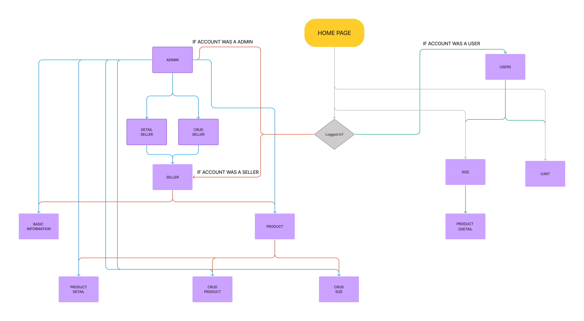
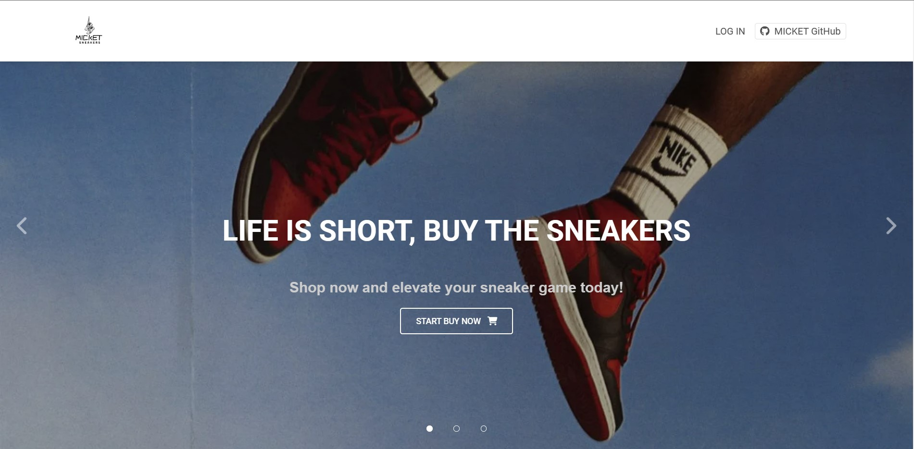
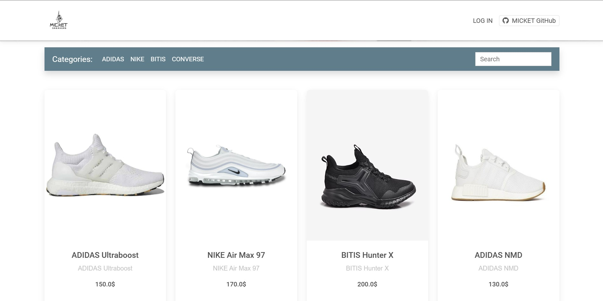
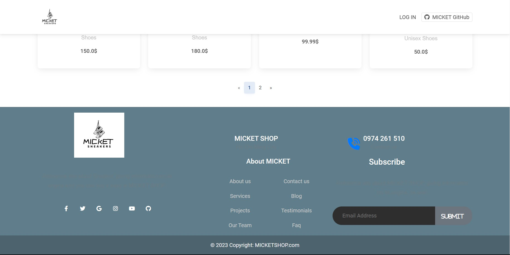
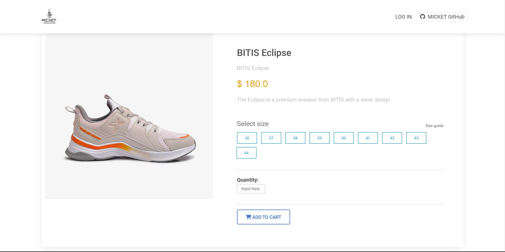
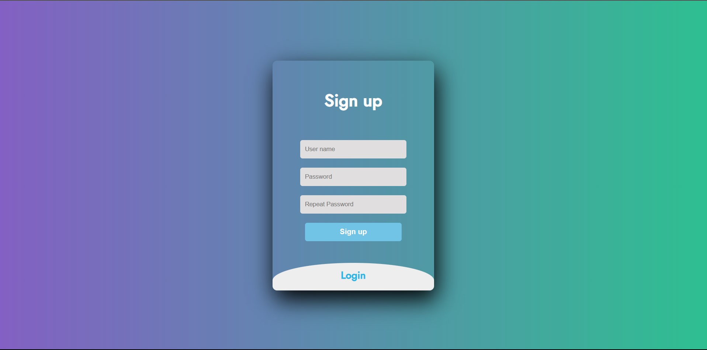
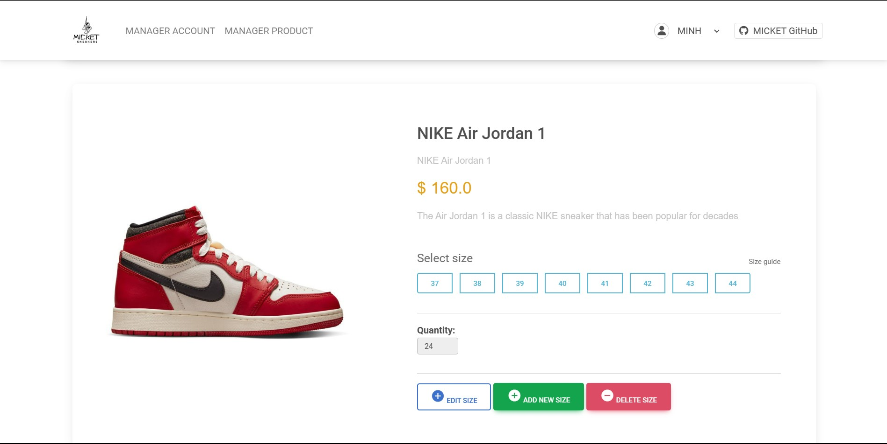
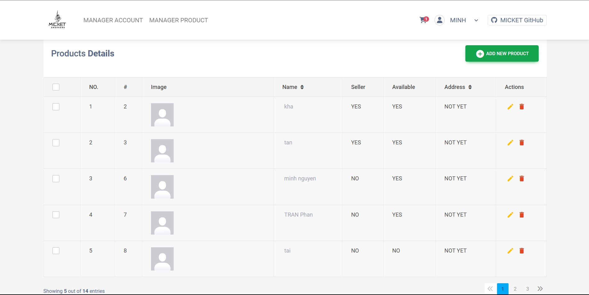
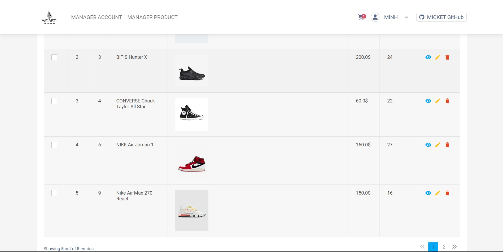
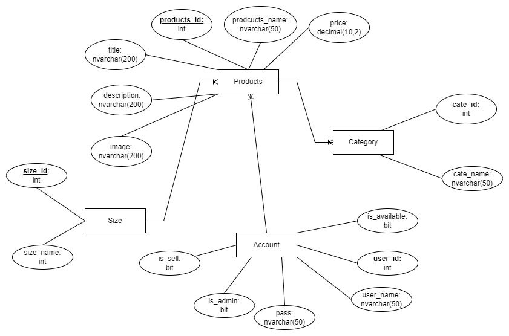

# prj301-se1735-10
## Nguyễn Viết Anh Minh - SE162107
## Vũ Khắc Duy Kha - SE162100
## Dương Minh Tấn - SS160653
## 1. Requirements:
### :athletic_shoe:  MICKET
### :star: The purpose of the shoe store e-commerce website is to:
  - Provide a convenient and accessible platform for customers to purchase shoes online
  - Offer a wide selection of shoes and related products to meet the needs and preferences of customers
  - Streamline the shopping experience with features such as product search, filters, shopping cart, and secure payment processing
  - Increase the store's reach and exposure to attract new customers and drive sales growth
  - Enhance customer satisfaction by offering a convenient, reliable, and secure shopping experience. 
### 👍 The website will be designed to be user-friendly and easy to use, and can be accessed from multiple devices such as PC, smartphones, laptops, tablets, etc. Therefore, it will be make easy for consumers by convenience and accessed anywhere.
### ☑️Main Features :
#### a. Product Management:
  - CRUD Prodcuts
  - Paging
  - Product detail
  - Search prodcuts by category and name
  - Management products by size
#### b. Account Management:
  - Seller account detail
  - CRUD Seller account
  - Account authorization
#### cc. Shopping Cart and Checkout:
  - Shopping cart management
  - Product quantity management
  - VAT calculation
## 2. Wireframe or screenshots of the system
  ### SITE MAP
  

  ### LOGO
  

  ### PAGE PHOTO
  &nbsp;
  &nbsp;
  &nbsp;
  &nbsp;
  
## 3. Database design:

## 4. System design:
  ### Teachnology:
  - Frontend
    - Browser - Microsoft Edge
    - JSTL - Standard Tag Library for JSP
    - Bootstrap 5 - A popular CSS Framework
  - Backend
    - Servlets - A Java class that extends the capabilities of the servers
    - Tomcat - A web server
    - JDBC - A Java API to connect and execute the query with the database
    - Maven - A powerful and widely used build automation tool that simplifies the process of managing dependencies, building, and deploying Java projects.
  - Database:
    - MySQL2022
  - Design:
    - draw.io
    - figma.com
    ###How to run:
    - We built this application with Netbean 8.2 so maybe you can use Netbean IDE to make it more easily to import project.
    - If you use other IDE such as Eclipse or Intellij IDEA, you will need to find the way to config this project before use.
    - After import this project to IDE, adding `Maven` and then use clean and built to download `Dependencies` from Maven
    - Then, you will need to change your account and pass to suit with you SQL in `DBUtils.java` and replace database connection information to suit your need.
    - Finally, setup database with my `database.sql` scripts.
    - That's all, enjoy MICKET!.
## 5. Conclusion and Discussion
#### 📈 Pros:
    - Friendly interface website easy to use
    - Having all necessary funtions.
#### 📉 Cons:
    - Product inventory management is not complete yet
    - No order funtion
    - Low 
❗ ## Our product is a user-friendly, easy-to-use shoe store that works for everyone. But besides that, there are still many small bugs and shortcomings in some basic functions that need improvement
